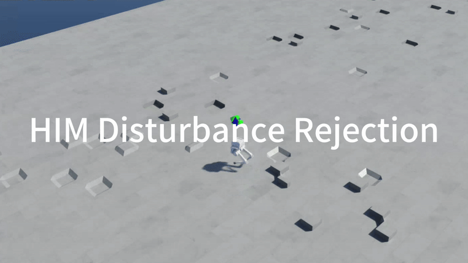
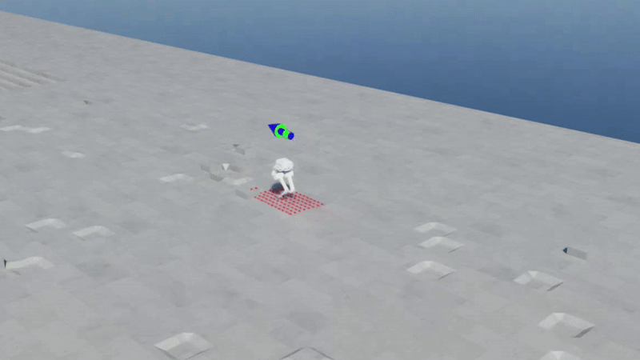
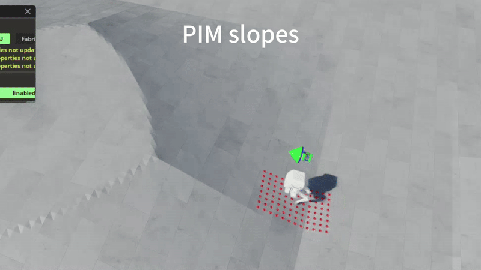
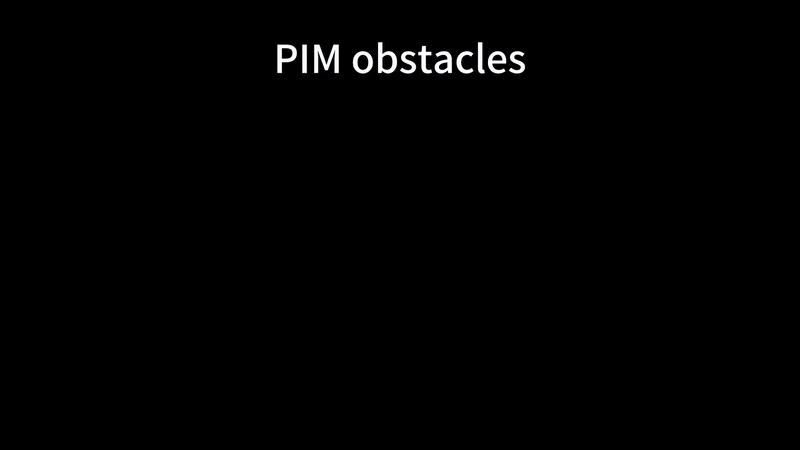
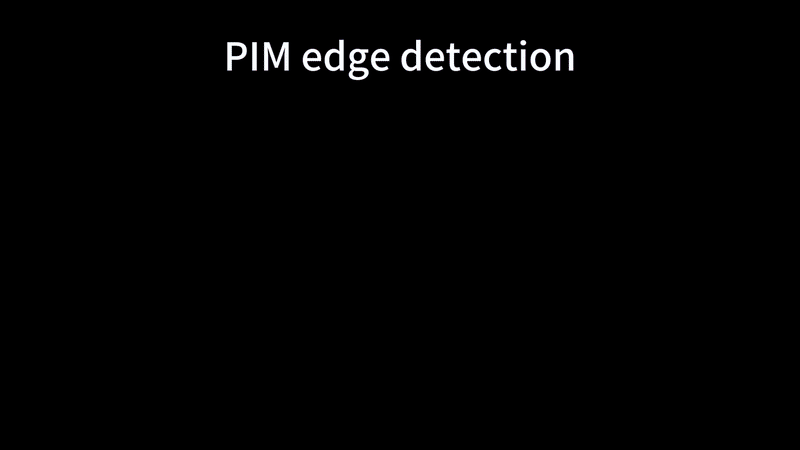

# **双足机器人强化学习运动控制 / Bipedal Robot RL Locomotion Control with Isaac Lab**

[](https://docs.isaacsim.omniverse.nvidia.com/4.5.0/index.html)
[](https://isaac-sim.github.io/IsaacLab/v2.1.0/index.html)
[](https://docs.python.org/3/whatsnew/3.10.html)
[](LICENSE)


---

## **概述 / Overview**

该仓库基于 [NVIDIA Isaac Lab](https://github.com/isaac-sim/IsaacLab) 仿真平台，对双足点足机器人（Point-foot Biped）[limxdynamics TRON1](https://www.limxdynamics.com/en/tron1) 进行基于强化学习的运动控制。
我们系统性地完成了从环境配置、奖励函数设计、策略训练到鲁棒性测试的完整流程，在双足机器人运动控制上运用了 HIM（Hybrid Internal Model）与 PIM（Perceptive Internal Model）算法，并对比和评估了两种策略架构在双足行走任务中的表现差异。

项目目标包括：
- 在平地环境中实现稳定、可控的双足行走；
- 实现对期望速度指令的精准跟踪；
- 通过随机外力扰动测试策略的抗干扰与恢复能力；
- 在复杂地形中测试策略的适应能力，如平地、上下楼梯、斜坡、障碍物、粗糙地面等；
- 对多种运动控制算法进行定性与定量比较（HIM 和 PIM）。

This repository is based on the [NVIDIA IsaacLab](https://github.com/isaac-sim/IsaacLab) simulation platform. For bipedal robot (Point-foot Biped) [limxdynamics TRON1](https://www.limxdynamics.com/en/tron1) for motion control based on reinforcement learning.
We systematically completed the entire process from environmental configuration, reward function design, strategy training to robustness testing, and applied HIM (Hybrid Internal Model) and PIM (Perceptive Internal Model) algorithms in the motion control of biped robots. And the performance differences of the two strategic architectures in the bipedal walking task were compared and evaluated.

The project goals include:
- Achieve stable and controllable bipedal walking in flat ground environments;
- Achieve precise tracking of expected speed instructions;
- Test the anti-interference and recovery capabilities of the strategy through random external force disturbances;
- Test the adaptability of the strategy in complex terrains, such as flat ground, going up and down stairs, slopes, obstacles, rough ground, etc.
Conduct qualitative and quantitative comparisons of multiple motion control algorithms (HIM and PIM).

**关键词 / Keywords:** Isaac Lab, TRON1，Bipedal Locomotion, Reinforcement Learning, PPO, HIM, PIM, Robust Control


---

## **1. 环境配置与安装 / Environment Setup & Installation**

请参考 IsaacLab 官方文档：[IsaacLab 安装](https://isaac-sim.github.io/IsaacLab/v2.1.0/source/setup/installation/pip_installation.html) 

Please refer to the official IsaacLab documentation: [IsaacLab Installation](https://isaac-sim.github.io/IsaacLab/v2.1.0/source/setup/installation/pip_installation.html)

- 新建 Conda 环境 / Create a new Conda environment
  ```bash
    conda create -n env_isaaclab python=3.10
    conda activate env_isaaclab 
  ```
- 安装 PyTorch / Install PyTorch
  ```bash
    pip install torch==2.5.1 torchvision==0.20.1 --index-url https://download.pytorch.org/whl/cu118
  ```
- 安装 IsaacSim / Install IsaacSim
  ```bash
    pip install --upgrade pip
    pip install 'isaacsim[all,extscache]==4.5.0' --extra-index-url https://pypi.nvidia.com
  ```
- 安装 IsaacLab / Install IsaacLab
  - 克隆 IsaacLab 仓库 / Clone the IsaacLab repository 
    ```bash
      git clone -b v2.1.0 https://github.com/isaac-sim/IsaacLab.git
    ```
  - 安装依赖 / Install the dependencies
    ```bash
      sudo apt install cmake build-essential
    ```
  - 安装 IsaacLab / Install IsaacLab
    ```bash
      cd IsaacLab
      ./isaaclab.sh --install
    ```
  
- 克隆并安装项目仓库 / Clone and install the project repository
  
  请将仓库克隆到 `IsaacLab` 文件夹之外！
  
  Please clone the repository outside the `IsaacLab` folder!

  ```bash
    git clone https://github.com/DongyangLin/SDM5008Project.git
    cd [repository name]
    python -m pip install -e exts/bipedal_locomotion
  ```

  为了使用 `MLP` 分支，需要卸载原生 `rsl_rl` 库，并安装新的 `rsl_rl` 库：
  
  In order to use the `MLP` branch, it is necessary to uninstall the native `rsl_rl` library and install the new `rsl_rl` library:

  ```bash
    pip uninstall rsl-rl-lib
    cd bipedal_locomotion_isaaclab/rsl_rl
    python -m pip install -e .
  ```

---

## **2. 训练与测试 / Training & Evaluation**

### 2.1 训练机器人 / Training

- Encoder-MLP 算法 / Encoder-MLP Algorithm
  使用 `scripts/rsl_rl/train.py` 脚本直接训练机器人，指定任务：

  Use the `scripts/rsl_rl/train.py` script to train the robot directly, specifying the task:

  ```bash
    python scripts/rsl_rl/train.py --task=Isaac-Limx-PF-Blind-Flat-v0 --headless
  ```

  以下参数可用于自定义训练：

  The following arguments can be used to customize the training:

    * --headless: 以无渲染模式运行仿真 / Run the simulation in headless mode
    * --num_envs: 要运行的并行环境数量 / Number of parallel environments to run
    * --max_iterations: 最大训练迭代次数 / Maximum number of training iterations
    * --save_interval: 保存模型的间隔 / Interval to save the model
    * --task: 选择任务名称 / Name of the task
    * --seed: 随机数生成器的种子 / Seed for the random number generator
    * --checkpoint_path: 训练起始点模型的相对路径 / Relative path to checkpoint file
  
- HIM 算法 / HIM Algorithm
  
  在 `scripts/rsl_rl/train.py` 中注释掉 `runner = OnPolicyRunner(...)`(131行) 并选择 `runner = HIMOnPolicyRunner(...)`(134行) 取消注释，使用 `scripts/rsl_rl/train.py` 脚本训练：

  Comment out `runner = OnPolicyRunner(...)` in `scripts/rsl_rl/train.py` (Line 131) and select `runner = HIMOnPolicyRunner(...)` (Line 134) uncomment, then  train the robot using the `scripts/rsl_rl/train.py` script:

  ```bash
    python scripts/rsl_rl/train.py --task=Isaac-Limx-PF-Stair-HIM-v0 --headless
  ```

- PIM 算法 / PIM Algorithm
  
  在 `scripts/rsl_rl/train.py` 中注释掉 `runner = OnPolicyRunner(...)`(131行) 并选择 `runner = PIMOnPolicyRunner(...)`(137行) 取消注释，使用 `scripts/rsl_rl/train.py` 脚本训练：

  Comment out `runner = OnPolicyRunner(...)` in `scripts/rsl_rl/train.py` (Line 131) and select `runner = PIMOnPolicyRunner(...)` (Line 137) uncomment, then  train the robot using the `scripts/rsl_rl/train.py` script:

  ```bash
    python scripts/rsl_rl/train.py --task=Isaac-Limx-PF-Stair-PIM-v0 --headless
  ```

### 2.2 运行训练好的模型 / Playing a trained model

- 运行训练好的 Encoder-MLP 模型：
  
  To play a trained Encoder-MLP model:

  ```bash
    python scripts/rsl_rl/play.py --task=Isaac-Limx-PF-Blind-Flat-Play-v0 --num_envs=50 --checkpoint_path=logs/rsl_rl/pf_tron_1a_flat/2025-12-15_16-38-07/model_3000.pt
  ```

  以下参数可用于自定义运行：

  The following arguments can be used to customize the playing:

    * --task: 选择任务名称 / Name of the task
    * --num_envs: 要运行的并行环境数量 / Number of parallel environments to run
    * --headless: 以无头模式运行仿真 / Run the simulation in headless mode
    * --checkpoint_path: 要加载的模型路径 / Path to the checkpoint to load

- 运行训练好的 HIM 模型：
  
  To play a trained HIM model:

  ```bash
    python scripts/rsl_rl/play_him.py --task=Isaac-Limx-PF-Stair-HIM-Play-v0 --num_envs=50 --checkpoint_path=logs/rsl_rl/pf_him_stair/2025-12-16_Stable_Phase_3/model_5000.pt
  ```

- 运行训练好的 PIM 模型：
  
  To play a trained PIM model:

  ```bash
    python scripts/rsl_rl/play_pim.py --task=Isaac-Limx-PF-Stair-PIM-Play-v0 --num_envs=50 --checkpoint_path=logs/rsl_rl/pf_pim_stair/2025-12-17_09-56-22/model_11000.pt
  ```

---

## **3. 视频演示 / Video Demonstration**

### 3.1 速度跟随 / Velocity Tracking

- **点足盲目平地 / Pointfoot Blind Flat**:
  

### 3.2 抗扰测试 / Disturbance Rejection

  | Encoder-MLP | HIM | PIM |
  | :---: | :---: | :---: |
  |  |  |  |

### 3.3 地形适应 / Terrain Traversal

- **HIM 地形适应 / HIM Terrain Traversal**
  |  |  |
  | :---: | :---: |
  | **** | **** |

- **PIM 地形适应 / PIM Terrain Traversal**
  |  |  |
  | :---: | :---: |
  | **** | **** |
  | **** |


---

## 4. 项目文件结构 / Project File Structure

```
SDM5008Project/                         # 项目根目录
├── README.md                           # 项目说明文档方
├── exts/
│   └── bipedal_locomotion/             # 主目录
│       ├── bipedal_locomotion/
│       │   ├── assets/                 # 机器人与环境相关资源
│       │   │   ├── config/             # 机器人结构与物理仿真参数配置
│       │   │   └── usd/                # USD 格式的机器人模型与场景资源
│       │   ├── tasks/                  # 任务定义模块
│       │   │   └── locomotion/          # 行走/运动任务
│       │   │       ├── agents/          # 强化学习智能体配置
│       │   │       ├── cfg/             # 环境与任务配置
│       │   │       │   └── PF/           # Point-Foot 机器人任务配置
│       │   │       ├── mdp/             # MDP（马尔可夫决策过程）定义
│       │   │       └── robots/          # 机器人环境封装
│       │   └── utils/                   # 工具函数
│       ├── config/                      # 扩展级别的全局配置
│       ├── docs/                        # 项目文档（设计说明、实验说明等）
│       └── setup.py                     # Isaac Lab 扩展安装脚本
├── logs/                               # 训练与测试日志（包含示例模型）
├── rsl_rl/                             # 强化学习算法实现（基于 RSL-RL）
└── scripts/                            # 实验运行脚本
    └── rsl_rl/
        ├── play.py                     # 使用训练好的模型进行测试
        ├── play_him.py                 # HIM 模型测试脚本
        ├── play_pim.py                 # PIM 模型测试脚本
        └── train.py                    # 模型训练主脚本

```

## 致谢 / Acknowledgements

本项目使用以下开源库：

This project uses the following open-source libraries:

- [IsaacLabExtensionTemplate](https://github.com/isaac-sim/IsaacLabExtensionTemplate)
- [bipedal_locomotion_isaaclab](https://github.com/Andy-xiong6/bipedal_locomotion_isaaclab)
- [tron1-rl-isaaclab](https://github.com/limxdynamics/tron1-rl-isaaclab.git)
- [HIMLoco](https://github.com/InternRobotics/HIMLoco.git)

**贡献者 / Contributors:**
- Zikun Zhuang
- Zhiyu Wang

