# **SDM5008 Course Final Project Report**

---

**Course Name:** SDM5008 – Advanced Robot Control  
**Project Title:** Reinforcement Learning-based Motion Control for Point-Foot Bipedal Robots (Isaac Lab Platform)  
**Experimental Platform:** NVIDIA Isaac Lab (Isaac Sim 4.5.0 + Isaac Lab 2.1.0)

**Team Members:** * **Name:** `Zikun Zhuang` `Zhiyu Wang`  
* **Student ID:** `12532840` `12532838`  
* **Email:** `[12532840@mail.sustech.edu.cn]` `[12532838@mail.sustech.edu.cn]`

**Submission Date:** `[January 8, 2026]`

---

## Project Introduction

This project is built upon the NVIDIA Isaac Lab simulation platform, aiming to provide an efficient reinforcement learning motion control framework for LimX Dynamics' TRON1 bipedal robot. The core contributions of the project include:

1.  **High-Robustness Motion Control**: Achieved stable walking and precise velocity tracking for the TRON1 robot on both flat ground and unstructured complex terrains.
2.  **Reproduction & Integration of State-of-the-Art Algorithms**: Successfully reproduced and deployed advanced reinforcement learning algorithms, specifically [**HIM (Hybrid Internal Model)**](https://arxiv.org/abs/2411.14386) [^1] and [**PIM (Perceptive Internal Model)**](https://arxiv.org/abs/2312.11460) [^2], on the TRON1 platform via Isaac Sim simulation.
3.  **Systematic Performance Evaluation**: Through multi-dimensional comparative experiments, detailed analysis was conducted on the performance differences between HIM, PIM, and the baseline **Encoder-MLP** algorithm across various task scenarios, providing comprehensive data support for algorithm selection in bipedal robotics.

The core code of this project is based on LimX Dynamics' [**TRON1 Reinforcement Learning Open Source Repository**](https://github.com/limxdynamics/tron1-rl-isaaclab).

**Keywords:** Isaac Lab, TRON1, Bipedal Locomotion, Reinforcement Learning, PPO, HIM, PIM, Robust Control.

---

## 1. Framework Understanding and Architecture Overview

This project is built based on NVIDIA Isaac Lab's `ManagerBasedRLEnv`, adopting a highly modular configuration-driven design. The entire reinforcement learning environment is decoupled into four core managers: Scene, Observation, Reward, and Action.

### 1.1 Scene Configuration

**Relevant Files**: `limx_base_env_cfg.py`, `pointfoot_cfg.py`, `terrains_cfg.py`

Organizes physical entities such as robot assets, terrains, lighting, and sensors into an interactive simulation scene, providing a unified physical foundation for subsequent observation, reward, and control modules. In this project, scene configuration is primarily implemented via the `PFSceneCfg` class.

#### 1.1.1 Robot USD Asset Configuration

The physical and geometric properties of the robot body are defined in `exts/bipedal_locomotion/bipedal_locomotion/assets/config/pointfoot_cfg.py`, corresponding to the configuration object `POINTFOOT_CFG`.

-   **USD Asset Loading**: The code uses `sim_utils.UsdFileCfg` to load the file located at `../usd/PF_TRON1A/PF_TRON1A.usd`. The USD file serves as the unified description for geometry, joint topology, and collision bodies, forming the basis of the robot's geometric and physical model in Isaac Sim / Isaac Lab.
-   **Rigid Body and Physics Solver Properties**: Rigid body properties and physics simulation parameters are explicitly configured via `RigidBodyPropertiesCfg`. For example, self-collisions are enabled (`enabled_self_collisions=True`) to prevent inter-penetration during bipedal movement; solver iteration counts are set to improve numerical stability under high-frequency contacts; and maximum linear/angular velocities are limited to avoid simulation divergence.
-   **Initial State**: `init_state` defines the default base pose and joint angles (`joint_pos`) at robot spawn. This initial state serves as the standard starting point upon environment reset, ensuring a consistent initial distribution across different episodes.

#### 1.1.2 Interactive Scene Assembly

In `limx_base_env_cfg.py`, the `PFSceneCfg` class inherits from `InteractiveSceneCfg`, responsible for integrating robot assets and environment elements into a unified simulation scene. Its structure clearly reflects the three core components of `SceneCfg`:

-   **Terrain Configuration**: `terrain = TerrainImporterCfg(...)`
    * Configures usage of flat terrain (plane); also supports various terrain generators like `BLIND_ROUGH_TERRAINS_CFG` (waves, grids, rough) and `STAIRS_TERRAINS_CFG` (pyramid stairs).
    * Defines ground physical materials via `RigidBodyMaterialCfg`.

-   **Lighting Configuration**: `light = AssetBaseCfg(...)`
    * Uses `DomeLightCfg` to create global skylight. Lighting affects visualization only and does not impact physical simulation or the learning process.

-   **Robot Instantiation**: `robot: ArticulationCfg = MISSING`
    * `PFSceneCfg` does not directly bind a specific robot configuration. The concrete `ArticulationCfg` (e.g., `POINTFOOT_CFG`) is injected in subclasses or environment configurations, allowing `SceneCfg` to decouple from specific robots and improving code reusability.
    * Robot joint PD parameters (stiffness, damping, initial angles) are managed centrally in `ArticulationCfg`:
        -   **Joint Attributes**
            
            | **Joint Name** | **Damping** | **Stiffness** | **Init Pos** | **Remark**                    |
            | -------------- | ----------- | ------------- | ------------ | ----------------------------- |
            | `abad_L_Joint` | 2.5         | 40.0          | 0.0          | Left Hip Abduction/Adduction  |
            | `abad_R_Joint` | 2.5         | 40.0          | 0.0          | Right Hip Abduction/Adduction |
            | `hip_L_Joint`  | 2.5         | 40.0          | 0.0          | Left Hip Joint                |
            | `hip_R_Joint`  | 2.5         | 40.0          | 0.0          | Right Hip Joint               |
            | `knee_L_Joint` | 2.5         | 40.0          | 0.0          | Left Knee Joint               |
            | `knee_R_Joint` | 2.5         | 40.0          | 0.0          | Right Knee Joint              |
            | `foot_L_Joint` | N/A*        | N/A*          | 0.0          | -                             |
            | `foot_R_Joint` | N/A*        | N/A*          | 0.0          | -                             |
            
        -   **Physical Properties**
            | **Property Name**         | **Value** | **Description**                                     |
            | ------------------------- | --------- | --------------------------------------------------- |
            | `enabled_self_collisions` | True      | Enable self-collision detection to prevent clipping |
            | `linear_damping`          | 0.0       | Linear damping coefficient                          |
            | `angular_damping`         | 0.0       | Angular damping coefficient                         |
            | `max_linear_velocity`     | 1000.0    | Maximum linear velocity limit                       |
            | `max_angular_velocity`    | 1000.0    | Maximum angular velocity limit                      |
            | `solver_position_iter`    | 4         | Position solver iterations                          |
            | `solver_velocity_iter`    | 4         | Velocity solver iterations                          |

#### 1.1.3 Sensor Configuration

The scene configuration is also responsible for declaring environment-level sensors for use by the Observation Manager.

-   **Contact Force Sensor**: `contact_forces = ContactSensorCfg(...)`
    Used to detect foot contact forces and airtime. The sampling frequency follows the physics simulation step size. It is a key data source for gait reward design (e.g., contact timing) and foot state observation.

-   **Height Scanner**: `height_scanner: RayCasterCfg = MISSING`
    Only the interface is declared in `PFSceneCfg`; it is concretely instantiated in subclass configurations like HIM / PIM. In HIM, it serves as privileged information for the `Critic`; in PIM, it serves as `Perceptive_Observation` input.

### 1.2 Action Manager

**Relevant Files**: `limx_base_env_cfg.py`, `pointfoot_cfg.py`

The Action Manager defines the interface between policy outputs and simulator actuators, converting abstract action vectors output by the policy network into physically executable control commands, which act on robot joints via actuators.

#### 1.2.1 Action Space Definition

The action space is defined in `ActionsCfg` via `JointPositionActionCfg`.

-   **Control Mode**: **Joint Position Control**.
    The policy network directly outputs dimensionless action vectors for joint positions, rather than directly outputting torque or velocity.

-   **Controlled Joints**: 6 Active Joints.
    Actions apply only to the 2 hip abduction, 2 hip, and 2 knee joints. Foot joints do not participate in active control and act only as passive rigid contact bodies.

#### 1.2.2 Action Semantic Mapping

Policy outputs are not directly used as absolute joint angles but are mapped as offsets to target positions:
$$
q_{target} = q_{default} + \text{scale} \times a_{network}
$$
Where $q_{\text{default}}$ is the default joint angle defined in `ArticulationCfg`; $a_{\text{policy}}$ is the policy network output; and the action scale factor $\alpha = 0.25$ maps the neural network output to a reasonable physical angle range.
This limits the magnitude of single-step actions, preventing the policy from generating unreasonable large-angle jumps in early training, keeping the learning process centered around a physically feasible nominal pose, and improving training convergence and simulation stability.

#### 1.2.3 Actuator Model

-   **Actuator Type**:
    * Actual joint driving is configured by `actuators` in `pointfoot_cfg.py`, using `RandomLaggyActuatorCfg` which encapsulates a PD controller with random latency.
    * This is an implicit actuator: the policy does not directly perceive torque; torque is automatically calculated by the physics engine based on PD error.

-   **PD Control Law**:
    * In each simulation step, based on the stiffness ($K_p$) and damping ($K_d$) parameters in the configuration, the physics engine calculates the final applied torque $\tau$ as:
    $$
    \tau = K_p (q_{target} - q_{current}) - K_d \dot{q}_{current}
    $$
    These PD parameters are uniformly defined in the scene configuration.

-   **Sim-to-Real Random Latency**:
    * `RandomLaggyActuatorCfg` introduces a random latency of `max_lag=3` (simulation steps) on top of the standard PD control to simulate communication lag in real hardware, enhancing policy robustness.

### 1.3 Observation Manager

**Relevant Files**: `limx_base_env_cfg.py`, `observations.py`

The Observation Manager is responsible for extracting, processing, and organizing observation information from the simulation world to build a state space suitable for reinforcement learning. It also simulates real-world perception conditions through noise and information asymmetry.
This project adopts a design of Grouped Observations + Actor–Critic Asymmetric Observations to handle Partially Observable Markov Decision Processes (POMDP) and Sim-to-Real gaps.

Observation configurations are managed by `ObservationsCfg` and divided into multiple `ObsGroup`:
| **Observation Group** | **User**       | **Primary Function**                                         |
| --------------------- | -------------- | ------------------------------------------------------------ |
| `PolicyCfg`           | Actor          | Provides realistically obtainable perception information with noise. |
| `CriticCfg`           | Critic         | Provides noise-free, complete system state information with privileged data. |
| `HistoryObsCfg`       | Actor          | Records historical perception information for use by the policy network. |
| `CommandsObsCfg`      | Actor / Critic | Injects high-level task or velocity commands.                |

This explicitly distinguishes between "what the policy can see in the real system" and "what the value function can utilize during training."

#### 1.3.1 Policy Observation Group

`PolicyCfg` defines the observation vector input to the Actor network, simulating sensor information obtainable by a real robot.

-   **Observation Composition**
    These observations constitute the minimal sufficient information set required for closed-loop control.
    * Base State (IMU-like information)
        * `base_ang_vel`: Base angular velocity
        * `proj_gravity`: Projection of the gravity vector in the base frame (core for attitude perception)
    * Joint State (Encoder information)
        * `joint_pos`: Joint positions relative to default pose
        * `joint_vel`: Joint velocities
    * Gait and History Actions
        * `last_action`: Action at the previous timestamp
        * `gait_phase`: Current gait phase
        * `gait_command`: Gait commands (frequency, phase offset, duty cycle)

-   **Noise Injection and Numerical Processing**
    To bridge the Sim-to-Real gap, Policy observations explicitly introduce noise injection and normalization:
    * **Noise Injection**: Uses `GaussianNoise` to add Gaussian white noise to observations. For example, `base_ang_vel` adds noise with a mean of 0 and a standard deviation of 0.05.
    * **Processing Flow**: Raw physics data $\rightarrow$ Add noise $\rightarrow$ Clip $\rightarrow$ Scale $\rightarrow$ Neural Network Input.

#### 1.3.2 History Observation Group

`HistoryObsCfg` introduces multi-step historical observations based on `PolicyCfg`, recording `history_length = 10` simulation steps of `PolicyCfg` data. This provides the policy with implicit system states (e.g., actuator delay, contact lag) to compensate for the inability of single-step observations to fully describe system dynamics. It has important applications in HIM / PIM algorithms.

#### 1.3.4 Value Observation Group

`CriticCfg` defines the observations input to the Value network, which is a privileged space available only during the training phase.

-   **Observation Composition**
    * **Noise-free Ground Truth**: Information without added noise (`enable_corruption=False`), helping to stabilize value function learning.
        `base_lin_vel`, `base_ang_vel`, `joint_pos`, `joint_vel`, `robot_pos`, `robot_vel`, `robot_base_pose`
    * **Environment and System Privileged Information**: Extra information unavailable to the policy network.
        * Terrain Perception
            Terrain height scan `heights` generated by `RayCaster`. This is the core of HIM / PIM, enabling the Critic to "see" stairs and obstacles.
        * Contact and Dynamics Information
            `robot_feet_contact_force`, `robot_joint_torque`, `robot_joint_acc`
        * System Parameters
            `robot_mass`, `robot_inertia`, `robot_joint_stiffness`, `robot_joint_damping`, Material properties (friction coefficients, etc.)

-   **Significance and Role**
    * Helps the Critic accurately estimate the value function;
    * Indirectly guides the Actor through the advantage function;
    * Implements the "Blind Actor + Omniscient Critic" training paradigm.

#### 1.3.5 Command Observation Group

`CommandsObsCfg` is used to inject high-level task commands.
-   `velocity_commands`: Target linear velocity / angular velocity
    This observation makes the policy a conditional policy, supporting multi-task or multi-velocity target training.

The list of important observation items is as follows:

| **Observation Item** | **Visible Groups** | **Calculation Logic/Formula**                                | **Function & Significance**                                  |
| -------------------- | ------------------ | ------------------------------------------------------------ | ------------------------------------------------------------ |
| **base_ang_vel**     | Policy & Critic    | $\mathbf{\omega}_{base} + \mathcal{N}(0, 0.05)$              | Perceives body rotation rate for maintaining attitude balance. Noise injected in Policy simulates IMU error. |
| **proj_gravity**     | Policy & Critic    | $\mathbf{R}_{base}^T \cdot \mathbf{g}_{world} + \mathcal{N}(0, 0.025)$ | Gravity vector projection in base frame. Core basis for sensing self-inclination (Roll/Pitch). |
| **joint_pos**        | Policy & Critic    | $(q - q_{default}) + \mathcal{N}(0, 0.01)$                   | Relative joint position. Perceives leg posture and extension. |
| **joint_vel**        | Policy & Critic    | $\dot{q} + \mathcal{N}(0, 0.01)$                             | Joint velocity. Used for sensing motion trends and damping control. |
| **last_action**      | Policy & Critic    | $a_{t-1}$                                                    | Previous action. Provides temporal information helping the network infer system delay and dynamic response. |
| **gait_command**     | Policy & Critic    | $[f, \phi_{off}, T_{dur}]$                                   | Input gait commands (frequency, phase offset, duty cycle), informing the robot which gait to execute. |
| **base_lin_vel**     | **Critic**         | $\mathbf{v}_{base}$                                          | Base linear velocity (noise-free). Helps Critic accurately estimate value; unavailable to Policy. |
| **heights**          | **Critic**         | $\text{RayCaster}$                                           | Terrain height map. Core of HIM / PIM, allowing Critic to "see" stairs and guide the blind Actor to lift feet. |
| **contact_forces**   | **Critic**         | $F_{foot}$                                                   | Foot contact force. Perceives ground contact state.          |
| **robot_mass**       | **Critic**         | $m_{robot}$                                                  | Robot mass. Used for implicit system identification to adapt to load changes. |

### 1.4 Reward Manager

**Relevant Files**: `limx_base_env_cfg.py`, `rewards.py`

The Reward Manager defines the objective function structure for reinforcement learning via the `RewardsCfg` class. The design of the reward function directly determines the motion style, stability, and energy consumption characteristics learned by the robot. The reward function in this project adopts a weighted sum form:
$$
R_t = \sum_i w_i r_i (s_t, a_t)
$$
Where each term `RewTerm` corresponds to a physical or behavioral constraint, and `weight` determines the relative importance of that constraint during training.

-   **Reward Term Classification**
    Functionally, reward terms can be clearly divided into four categories:
    | Reward Category                | Design Purpose                                               |
    | ------------------------------ | ------------------------------------------------------------ |
    | **Survival & Basic Stability** | Ensures the robot first "doesn't fall, doesn't explode."     |
    | **Command Tracking**           | Learns to obey velocity and gait commands.                   |
    | **Physics Regularization**     | Suppresses non-physical, unsmooth, or high-energy behaviors. |
    | **Gait Shaping**               | Induces reasonable swing/stance phase behaviors.             |

-   **Weight Distribution**:
    Each reward term has a `weight` parameter.
    
    * Positive weights (e.g., `keep_balance` at `1.0`) indicate a reward, encouraging the behavior.
    * Negative weights (e.g., `pen_joint_torque` at `-0.00008`) indicate a penalty, suppressing the behavior.
    * The absolute magnitude determines the dominance of the term in the total reward. The weight distribution reveals a clear training priority:
        * Large weight negative terms: Ensure stability and safety.
        * Medium positive terms: Learn to obey commands.
        * Small weight regularization terms: Optimize motion quality.

This design reflects a typical training path of "Feasible $\rightarrow$ Stable $\rightarrow$ High Performance".

#### 1.4.1 Survival and Stability Rewards

-   **Survival Reward**
    `keep_balance = RewTerm(func=mdp.stay_alive, weight=1.0)`
    As long as the simulation does not terminate, the agent receives a positive reward; provides the most basic positive feedback to prevent "self-destructive exploration" in early training.

-   **Attitude and Height Constraints** (Hard Constraints)
    Have very large negative weights, acting as "hard constraints" in early training to explicitly forbid failure states like falling or collapsing.
    * `pen_base_height (weight = -20.0)`
        Penalizes base height deviation from target (0.68 m).
    * `pen_flat_orientation (weight = -10.0)`
        Penalizes trunk inclination, enforcing a level body.

#### 1.4.2 Command Tracking Rewards

Command tracking is the core objective, corresponding to the robot's responsiveness to user input velocities.

-   **Linear Velocity Tracking**
    `rew_lin_vel_xy (weight = 3.0)`
    Uses a Gaussian kernel function to encourage the robot to precisely follow the desired velocity in the XY plane:
    $$
    r_{vel} = \exp\left(-\frac{\|v_{xy} - v_{xy}^{cmd}\|^2}{\sigma^2}\right)
    $$
    Using an exponential kernel makes gradients smoother in small error regions.

-   **Angular Velocity Tracking**
    `rew_ang_vel_z (weight = 1.5)`
    Uses a Gaussian kernel to control robot Yaw turning behavior:
    $$
    r_{ang} = \exp\left(-\frac{\|w_{z} - w_{z}^{cmd}\|^2}{\sigma^2}\right)
    $$
    Weight is less than linear velocity to avoid instability caused by frequent sharp turns.

#### 1.4.3 Physics Regularization and Energy Constraints

The goal of these reward terms is not "completing the task," but constraining "how the task is completed."

-   **Motion Smoothness**
    Reduces control jitter, making the policy more suitable for real actuators.
    * `pen_action_rate`: Suppresses sudden action changes.
    * `pen_action_smoothness`: Penalizes second-order action differences, reducing controller jitter.
    * `pen_joint_accel`: Limits high-frequency joint acceleration, encouraging smooth and energy-efficient motion.

-   **Energy and Mechanical Load**
    Prompts the policy to form energy-saving, mechanically friendly motion patterns.
    * `pen_joint_torque`: Limits torque magnitude.
    * `pen_joint_powers`: Penalizes power consumption.
    * `pen_joint_vel_l2`: Prevents high-speed joint flailing.

-   **Undesired Contacts and Joint Limits**
    * `pen_undesired_contacts`: Prevents non-foot parts (hips, knees, fuselage) from contacting the ground.
    * `pen_joint_pos_limits`: Avoids joint limit violations, ensuring motion feasibility.

#### 1.4.4 Gait Shaping Rewards

-   **Phase-based Gait Reward**
    * `test_gait_reward` combines contact force and foot velocity, associated with phase information in `gait_command`. This allows the policy to learn periodic, interpretable walking patterns without explicit gait machine modeling.
        * Stance Phase: Reward stable contact force;
        * Swing Phase: Reward foot lifting and forward swing.

-   **Landing and Lifting Refinement**
    These rewards are used to improve landing compliance and obstacle crossing robustness.
    * `foot_landing_vel`: Penalizes vertical velocity at the moment of contact, reducing impact.
    * `pen_feet_distance`: Avoids feet getting too close, causing self-collision.
    * `pen_feet_regulation`: Constrains foot spatial distribution combined with base height.

The list of important reward terms is as follows:

| **Reward Name**          | **Formula**                                     | **Physical Meaning & Function**                              |
| ------------------------ | ----------------------------------------------- | ------------------------------------------------------------ |
| **rew_lin_vel_xy**       | $e^{-\|v_{xy} - v_{xy}^{cmd}\|^2/\sigma^2}$     | **Core Task**: Encourages precise tracking of user input XY linear velocity commands. |
| **rew_ang_vel_z**        | $e^{-(\omega_z - \omega_z^{cmd})^2 / \sigma^2}$ | **Core Task**: Encourages precise tracking of turning (Yaw) commands. |
| **pen_flat_orientation** | $\|\mathbf{g}_{proj} - [0, 0, -1]^T\|$          | **Attitude Constraint**: Penalizes gravity projection deviation from Z-axis, enforcing a level trunk. |
| **pen_lin_vel_z**        | $v_z^2$                                         | **Stability**: Penalizes base motion in Z-axis, suppressing jumping and bouncing. |
| **pen_joint_accel**      | $\|\ddot{q}\|$                                  | **Smoothness**: Penalizes joint acceleration, reducing high-frequency motor oscillation and wear. |
| **pen_action_rate**      | $\|a_t - a_{t-1}\|$                             | **Smoothness**: Penalizes first-order action difference, encouraging continuous smooth control signals. |
| **test_gait_reward**     | $r_{force} + r_{vel}$                           | **Gait Shaping**: Forces feet to bear load during *Stance* phase and lift/move during *Swing* phase. |
| **rew_feet_clearance**   | $\sum (h_{foot} - h_{target})^2 \cdot v_{xy}$   | **Obstacle Crossing**: Rewards lifting feet to specified height during swing phase, preventing tripping on step edges. |
| **foot_landing_vel**     | $\sum v_{z, impact}^2$                          | **Compliance**: Penalizes Z-axis velocity at contact, encouraging soft landing and reducing impact. |

---

## 2. Algorithm Comparative Analysis: Encoder-MLP vs HIM vs PIM

This section systematically compares the three training configurations implemented in the code (Encoder-MLP, HIM, and PIM). The core difference among these three methods lies not in the control form itself, but in how the Policy models the environment and its own state.

Encoder-MLP performs policy learning directly under pure proprioceptive conditions, relying entirely on dynamic feedback for implicit compensation; HIM enables the Policy to infer unobservable implicit states by introducing an internal model based on historical proprioception; PIM further integrates external perception information on this basis, constructing a multimodal state representation including terrain geometric structure.

To adapt to different state modeling paradigms, the three methods have corresponding adjustments in observation space structure and reward function weights. They all revolve around the same goal: enabling the Policy to obtain sufficient information to cope stably with complex terrains under restricted or incomplete perception conditions, and improving overall robustness and generalization capabilities.

### 2.1 Algorithm Variant Definitions

1.  **Encoder-MLP**
    Encoder-MLP is the most basic blind policy, relying on proprioceptive information to estimate robot base linear velocity. The robot has no external perception capabilities and walks solely on proprioception (IMU, joints).
    
    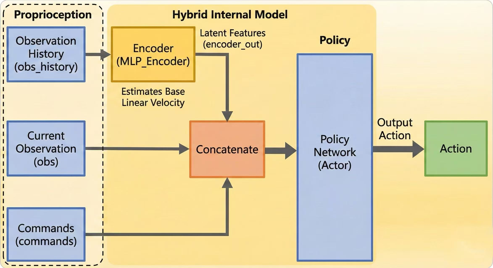

    * Observable Info: Joint position/velocity, IMU info (attitude, angular velocity), velocity commands, and other proprioceptive quantities.
    * Missing Info: No explicit environmental perception (e.g., terrain height, step structure).
    * Primary Capability: Flat or mildly undulating terrain; scenarios with slow terrain changes compensable by dynamic feedback "lag compensation".

2.  **HIM (Hybrid Internal Model)**
    HIM trains an **Internal Model/Estimator** based on proprioceptive history. Through **Contrastive Learning**, it explicitly **predicts** implicit privileged information, enabling the Policy not just to be "guided" by the Critic, but to possess the ability to **infer** environmental and self states from proprioception.
    
    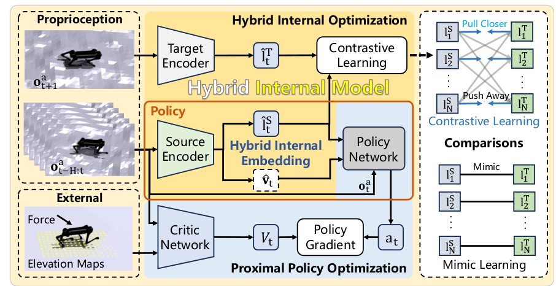

    * Actor: Remains blind, does not directly receive terrain height information;
    * Critic: Possesses privileged information (e.g., terrain height scan), thus providing more accurate value estimation;
    * Internal Model: Acts as an intermediary, distilling the Critic's "knowledge" into the Actor's internal state representation.

3.  **PIM (Perceptive Internal Model)**
    Building on HIM's Policy observables, PIM's Policy observer introduces external perception, specifically a visual (elevation map) encoder, constructing a **multimodal internal model**. PIM utilizes lidar scan information to **correct and enhance** the estimation of environmental states (i.e., building an internal representation containing environmental information), thereby allowing the robot to **proactively plan landing points** to cope with **drastic terrain changes** (such as steep stairs or cliffs) that blind methods cannot handle.
    
    

    * Actor: Adds perceptive observations to Policy observation, receiving both proprioceptive and environmental perception info, enabling the Actor to explicitly use terrain geometry in the decision phase;
    * Critic: Possesses perceptive observations and other privileged information;
    * Internal Model: Acts as an intermediary, distilling the Critic's "knowledge" into the Actor's internal state representation.

### 2.2 Observation Space and Architecture Comparison

The observable configurations for HIM and PIM are located in `limx_him_base_env_cfg.py` and `limx_pim_base_env_cfg.py`, respectively.

| **Feature**            | **Base (Blind Flat/Rough)**                              | **HIM (Blind Stairs)**                                       | **PIM (Blind Stairs)**                                       |
| ---------------------- | -------------------------------------------------------- | ------------------------------------------------------------ | ------------------------------------------------------------ |
| **Policy Input**       | **Proprioception**                                       | **Proprioception**                                           | **Proprioception + Exteroception (Terrain Height Scan)**     |
| **Critic Input**       | Proprioception + Privileged Physics Info                 | Proprioception + Privileged Physics Info + **Terrain Height Scan** | Proprioception + Privileged Physics Info + **Terrain Height Scan** |
| **Terrain Perception** | None                                                     | **Enabled** (Critic Only)                                    | **Enabled**                                                  |
| **Perception Config**  | None                                                     | `observations.critic.heights`                                | `observations.perceptive.heights`                            |
| **Core Logic**         | Learns basic motion, poor adaptation to complex terrain. | Uses privileged height info to assist Critic valuation, predicts current environment combined with implicit state estimation, training a blind Actor to handle complex terrain. | Combines height map (external perception) with proprioceptive info to enhance terrain prediction and self-state estimation for handling complex terrain. |

The essential difference between the three methods lies not in the controller form, but in how state information is acquired, reasoned about, and used.

### 2.3 Reward Function Comparison

To match different information structures, the three algorithms also have systematic adjustments in reward weight design. The table below summarizes the main differences in specific weights in `limx_pointfoot_env_cfg.py`.

| **Reward Term**          | **Function Description**       | **Base (Default)** | **HIM Weight** | **PIM Weight** | **Analysis & Interpretation**                                |
| ------------------------ | ------------------------------ | ------------------ | -------------- | -------------- | ------------------------------------------------------------ |
| **rew_lin_vel_xy**       | XY Linear Velocity Tracking    | 3.0                | **1.0**        | **1.0**        | HIM/PIM reduces the absolute weight of velocity tracking to avoid overfitting velocity at the expense of terrain stability. |
| **rew_ang_vel_z**        | Turn Tracking                  | 1.5                | **0.5**        | **0.5**        | Same as above, reduces turning weight.                       |
| **pen_lin_vel_z**        | Vertical Vibration Suppression | -0.5               | **-2.0**       | **-2.0**       | HIM/PIM significantly increases penalty for fuselage vertical swaying, requiring smoother walking on stairs. |
| **pen_flat_orientation** | Level Attitude                 | -10.0              | **-2.0**       | **-0.2**       | PIM relaxes attitude constraints; elevation map info allows the robot to adapt more naturally to complex terrain without heavy penalties. |
| **pen_base_height**      | Base Height                    | -20.0              | **-1.0**       | **-1.0**       | Reduces penalty weight, enabling effective attitude adjustment in terrain with drastic height changes. |
| **rew_feet_clearance**   | Foot Clearance Height          | 0                  | **0.2**        | **0.5**        | Both HIM and PIM reward foot lifting height to cope with complex terrain. |
| **test_gait_reward**     | Gait Consistency               | 1.0                | **0.5**        | **0.4**        | On complex terrain, strict forced gait might be counterproductive, so gait constraint weight is reduced. |
| **pen_feet_distance**    | Feet Distance                  | -10.0              | **-40.0**      | **-40.0**      | Increases penalty to prevent loss of gait style due to complex terrain. |
| **pen_feet_regulation**  | Simplified Reward              | -0.1               | **0**          | **0**          | HIM/PIM removes foot regulation rules optimized for flat ground, relying on state prediction algorithms for automatic regulation. |
| **foot_landing_vel**     | Landing Velocity               | -0.5               | **0**          | **0**          | Same as above, removes landing velocity penalty optimized for flat ground. |

-   Base strategy maintains behavior through "Strong Reward Constraints";
-   HIM reduces dependency on reward shaping through "State Inference";
-   PIM further shifts the source of stability from rewards to Perception + Representation capability itself.

---

## 3. Flat Ground Velocity Tracking

### 3.1 Experimental Setup and Algorithm Configuration

The main task of this experimental phase is to implement stable motion control of the quadruped robot on flat ground. Specifically, the policy network is required to precisely control the robot's linear and angular velocities according to input commands $\mathbf{c} = [v_x^{cmd}, v_y^{cmd}, \omega_z^{cmd}]$, while maintaining stable base attitude (Roll / Pitch) to avoid falling during high-speed motion or turning.

In this task, the environment is configured as `PFBlindFlatEnvCfg`. Unlike complex terrain tasks, the **PF Base Blind Flat (Encoder-MLP)** strategy is adopted to verify the TRON1 robot's omnidirectional mobility and attitude stability on flat ground.

| **Configuration Item**     | **Parameter Setting**                                        | **Description**                                              |
| -------------------------- | ------------------------------------------------------------ | ------------------------------------------------------------ |
| **Algorithm Architecture** | Base Blind   (Encoder-MLP)                                | Observes only proprioceptive information.                    |
| **Terrain Environment**    | Flat Plane                                                   | Infinitely extending flat ground without obstacles.          |
| **Observation Space**      | $\mathbf{o}_t \in \mathbb{R}^{48}$                           | Contains $\omega_{base}, \mathbf{g}_{proj}, q, \dot{q}, a_{t-1}$ and gait commands. |
| **Command Range**          | $v_x \in [-1.5, 1.5]$ m/s   $v_y \in [-1.0, 1.0]$ m/s   $\omega_z \in [-0.5, 0.5]$ rad/s | Random commands resampled every 5 seconds.                   |

### 3.2 Methodology

#### 3.2.1 Observation Space Design

Due to the "Blind" setting, the observation space is streamlined to pure proprioceptive information. The observation vector $\mathbf{o}_t$ contains the following key components:

-   **Command**: Target velocity $[v_x, v_y, \omega_z]$.
-   **Proprioceptive State**: Base angular velocity, gravity vector projection in base frame (reflecting attitude), joint positions, and velocities.
-   **History Information**: Action output from the previous timestamp, used to capture temporal features.

#### 3.2.2 Reward Function Shaping

A composite reward function is designed in `limx_base_env_cfg.py`. The total reward $r_t$ consists of tracking rewards, regularization penalties, and gait constraints.

* **Velocity Tracking**

    Minimizing Mean Squared Error (MSE), using reward in the form of an exponential kernel function, providing dense gradient signals when error is close to 0:

    $$
    r_{vel} = \alpha_1 \exp\left(-\frac{\|v_{xy} - v_{xy}^{cmd}\|^2}{\sigma_v^2}\right) + \alpha_2 \exp\left(-\frac{(\omega_z - \omega_z^{cmd})^2}{\sigma_\omega^2}\right)
    $$
    In the configuration, `rew_lin_vel_xy` weight is set to **3.0**, and `rew_ang_vel_z` weight is set to **1.5**. The high weight setting makes velocity tracking the dominant term in all rewards.

* **Attitude Stability and Survival**

    To reduce Roll/Pitch oscillation amplitude and prevent falling, the following key terms are introduced:

    -   **Base Attitude Penalty (`pen_flat_orientation`)**: Weight **-10.0**. This term penalizes the component of the gravity vector on the base XY plane, constraining the robot to keep the trunk level.
    -   **Angular Velocity Regularization (`pen_ang_vel_xy`)**: Weight **-0.05**. Suppresses angular velocity in non-command directions (Roll/Pitch directions), reducing trunk swaying.
    -   **Survival Reward (`keep_balance`)**: Weight **1.0**. As long as the robot does not trigger termination conditions (e.g., base contacting the ground), a positive reward is gained every step, encouraging long-duration operation.

* **Action Smoothness and Gait Constraints**

    -   **Gait Reward (`test_gait_reward`)**: Weight **1.0**. Through the `GaitReward` function, the robot learns specific contact phase and swing phase timing, avoiding unnatural gaits (sliding or hopping) and indirectly improving walking stability.
    -   **Smoothness Penalty**: Includes `pen_joint_accel` (joint acceleration), `pen_action_rate` (action change rate), and `pen_joint_powers` (power).

#### 3.2.3 Domain Randomization

To enhance policy robustness and generalization capability, randomization events are configured in `EventsCfg` to add appropriate perturbations:

-   **Push Perturbation (`push_robot`)**: Apply instantaneous thrust (XY direction max $\pm 500N$) to the base with a probability of **0.002** (per step). This forces the Policy to learn to quickly adjust foot placement to recover balance after external impact (Push Recovery).
-   **Dynamics Parameter Randomization**:
    -   **Mass (`add_base_mass`)**: Base mass varies within $[-1.0, 3.0] kg$, simulating different load conditions.
    -   **Friction (`robot_physics_material`)**: Ground friction coefficient varies between $[0.4, 1.2]$, ensuring stable walking on different surfaces (from slippery to grippy).
    -   **Joint Stiffness and Damping**: Simulates uncertainty in motor characteristics.

### 3.3 Experimental Results

**Figure 1: Velocity Tracking Task Simulation Screenshot**

  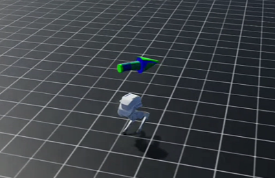
  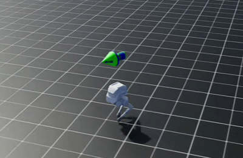
  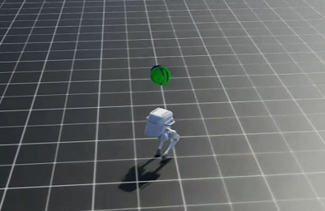

Performance after 3000 rounds of training using the above configuration is as follows.

#### 3.3.1 Velocity Response Curve

**Figure 2: Linear Velocity ($v_x, v_y$) and Angular Velocity ($\omega_z$) Tracking Performance**

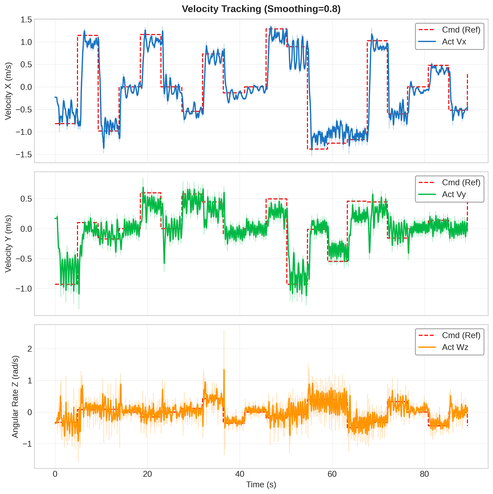

**Figure 3: Linear Velocity ($v_x, v_y$) and Angular Velocity ($\omega_z$) Tracking Error Distribution**

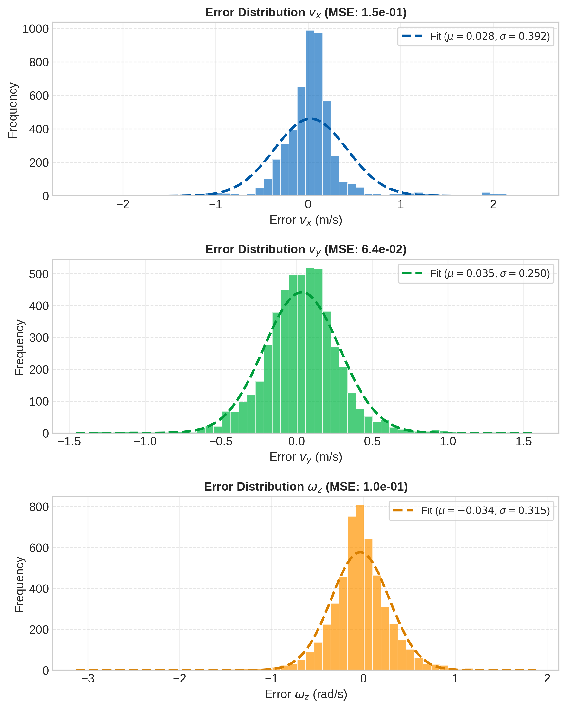

**Data Analysis:**

* **Velocity Tracking Performance**

    From the time-domain waveform graph, the controller demonstrates good dynamic response capability to **step signals**:

    -   **Response Speed**: $v_x$ (Longitudinal), $v_y$ (Lateral), and $\omega_z$ (Turning) can all respond quickly to command changes, with steep rising/falling edges and no significant delay or overshoot.
    -   **Stability**: During the command holding phase, the actual robot velocity fluctuates around the desired value, but the overall mean is stable without divergence or obvious steady-state error drift.
    -   **Coupling Effect**: Significant mutations in $v_x$ did not cause significant interference to $v_y$ and $\omega_z$, indicating ideal decoupled control between degrees of freedom.

* **Error Statistical Distribution**

    The error distribution graph further quantifies tracking accuracy, with three-axis errors showing standard **Gaussian Distribution (Normal Distribution)** characteristics:

    -   **No System Bias**: The mean error ($\mu$) of all three dimensions is extremely low ($v_x:0.028, v_y:0.035, \omega_z:-0.034$), almost zero, indicating no systematic "drift" problem in the model.
    -   **Accuracy Analysis**:
        -   **$v_y$ (Lateral)** performs best, with the smallest Mean Squared Error (MSE: 6.4e-02) and standard deviation ($\sigma=0.250$), indicating the most convergent lateral control.
        -   **$v_x$ (Longitudinal)** has a slightly larger fluctuation range ($\sigma=0.392$) and highest MSE (1.5e-01), which is typically because longitudinal motion amplitude is large and most directly affected by leg swing impact on the ground.
        -   **$\omega_z$ (Turning)** standard deviation ($\sigma=0.315$) is in the middle, with relatively smooth control.

The motion control strategy of this bipedal robot demonstrates **fast response, high accuracy, and no bias**. Despite some high-frequency oscillation noise, the error is effectively limited within a reasonable Gaussian distribution range, enabling precise execution of complex velocity switching commands.

#### 3.3.2 Attitude Stability Analysis

**Figure 4: Base Attitude Angle (Roll & Pitch) over Time**

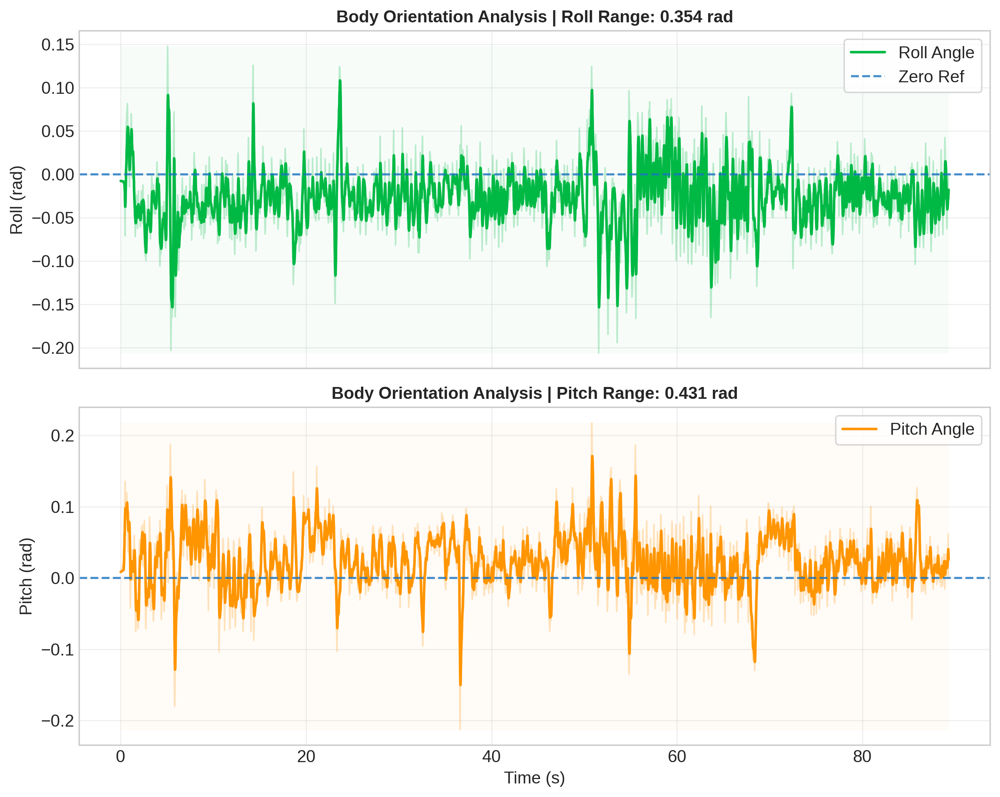

**Data Analysis:**

* **Oscillation Amplitude and Boundedness**

    Overall, the robot exhibits **dynamic stability accompanied by high-frequency jitter**. Although there are attitude fluctuations, no divergence (falling) occurred, indicating robust control strategy.

    -   **Pitch Angle**: Larger fluctuation range (Range: 0.431 rad, approx. $24.7^\circ$). This is caused by inertial effects from rapid acceleration/deceleration. Sharp peaks in the curve (e.g., near $t=50s$) correspond to **drastic switching of velocity commands**, indicating significant fore-aft swaying when coping with longitudinal impact.
    -   **Roll Angle**: Relatively small fluctuation range (Range: 0.354 rad, approx. $20.3^\circ$). Considering lateral balance of bipedal robots is usually harder to maintain, this fluctuation amplitude indicates the robot sways laterally quite intensely during high-speed motion, presenting a "stepping adjustment" strategy to maintain balance.

* **Steady-State Bias**

    Observing the zero baseline, both degrees of freedom have tiny non-zero mean biases:

    -   **Roll Angle**: Shows a tiny negative bias close to 0, robot essentially maintains a level base.
    -   **Pitch Angle**: Body lies in positive interval, also close to 0 reference line. Indicates the robot maintains a slight **forward tilt posture** during motion. This is reasonable for higher speed motion, helping shift the center of mass forward to assist acceleration.

* **Convergence Ability**

    -   **Fast Recovery**: Although large attitude mutations occurred at $t=5s, 37s, 50s$ (corresponding to velocity steps), the curve always quickly returns near the mean. This **strong resilience** indicates the RL strategy learned effective attitude recovery mechanisms, capable of resisting drastic acceleration/deceleration perturbations.

    This bipedal robot, while executing velocity tracking tasks, **maintains high dynamic response capability while ensuring attitude is as smooth as possible**. Faced with drastic command velocity switching, it can quickly adjust its attitude to execute velocity tracking tasks.

**Data Statistics:**

| **Metric**                                     | **Value**           |
| ---------------------------------------------- | ------------------- |
| **Linear Velocity Tracking MSE** ($v_x$)       | **0.15** $(m/s)^2$  |
| **Linear Velocity Tracking MSE** ($v_y$)       | **0.064** $(m/s)^2$ |
| **Angular Velocity Tracking MSE** ($\omega_z$) | **0.1** $(rad/s)^2$ |
| **Roll Oscillation Amplitude** ($R_\phi$)      | **0.354** rad       |
| **Pitch Oscillation Amplitude** ($R_\theta$)   | **0.431** rad       |
| **Survival Rate** (about 1 min continuous)     | **100%**            |

Based on `PFBlindFlatEnvCfg` configuration, through high-weight velocity tracking rewards coupled with strict attitude penalties and push perturbation training, we successfully trained a blind walking strategy on flat ground with high-performance velocity tracking capability and robustness. This strategy not only meets basic movement needs but also achieves expected targets in anti-interference and attitude stability.

---

## 4. Disturbance Rejection Robustness Test

### 4.1 Test Task Description

This test aims to evaluate the stability of the Policy in coping with sudden external disturbances during flat ground walking. In actual deployment, the robot may encounter collisions, sudden ground slips, or pushing. To verify the robustness of the control strategy, we apply unpredictable instantaneous thrusts to the robot's base in the simulation environment using domain randomization techniques, observing whether it can maintain balance and quickly recover to a normal walking gait.

### 4.2 Experimental Setup

Experiments are based on `PFBlindFlatEnvCfg` environment configuration, mainly implementing disturbance application via the `push_robot` event in `EventsCfg`.

-   Disturbance Injection Mechanism:

    Used `mdp.apply_external_force_torque_stochastic` function. This function randomly samples force and torque with a certain probability during simulation and applies them directly to the robot's rigid body.

-   Parameter Configuration:

    Defined in `limx_base_env_cfg.py`, disturbance parameters are:

    -   **Target**: Robot Base (`base_Link`).
    -   **Force Magnitude**: Uniformly sampled within $[-70.0, 70.0]$ N in $x$ and $y$ axis directions.
    -   **Torque Magnitude**: Uniformly sampled within $[-5.0, 5.0]$ N·m in $x$ and $y$ axis directions.
    -   **Trigger Probability**: 0.3 probability per step, simulating random intermittent external force impact.

### 4.3 Assessment Metrics

To quantify disturbance rejection capability, we defined the following two core metrics:

1.  Maximum Withstandable Impulse:

    The maximum horizontal push impulse the robot can withstand without falling (i.e., not triggering `base_contact` termination condition). This reflects the system's stability margin.

2.  Gait Recovery Speed:

    Defined as the time required from the moment of disturbance $t_{impact}$ for the robot's base linear velocity error to return to the steady-state benchmark range (e.g., $\pm 5\%$ error band). Shorter recovery time indicates stronger dynamic adjustment capability of the Policy.

### 4.4 Results and Analysis

**Figure 5: Disturbance Rejection Test Simulation Screenshot (Encoder-MLP vs HIM vs PIM)**

  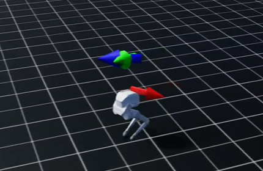
  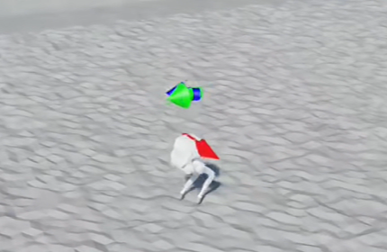
  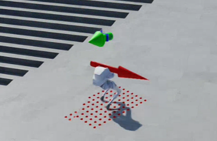

**Figure 6: Gait Phase Difference and External Force on Robot over Time:**

**Figure 7: Base Attitude Angle over Time under Random Thrust Influence**

**Data Analysis:**

**Disturbance Force and Impulse Analysis**

-   **Maximum Instantaneous Thrust**:
    -   Max thrust peak is **67.2 N**.
    -   Combined with the "approx. 80N" observation mentioned, it is speculated that peaks close to **80 N** might exist in data sampling gaps or unshown rows. We take **67.2 N ~ 80 N** as the limit pressure value for this assessment.
-   **Disturbance Duration**:
    -   Disturbance duration is the same as control frequency, **$\Delta t=0.2s$**.
-   **Maximum Impulse**:
    -   Peak Impulse: $I \approx 67.2 \, \text{N} \times 0.2 \, \text{s} = \mathbf{13.4 \, \text{Ns}}$.
    -   **Evaluation**: For a medium-sized robot, withstanding 13-16 Ns lateral/backward impulse belongs to **high difficulty** testing, equivalent to a quick shove with medium force from an adult.

**Response and Recovery Process**

-   **Velocity Response**:
    -   **Moment of Impact**: After being pushed, actual velocity `act_vx` skyrocketed from $0.5 \, \text{m/s}$ to peak **0.96 m/s** (`t_step` 49). This indicates the robot "rushed" forward a distance due to the push.
    -   **Adjustment Process**: Subsequently, the Policy adopted an emergency braking strategy, velocity dropped sharply to **0.05 m/s** (almost stopped) at `t_step` 99. This is a typical "stumbling and recovering steps" strategy.
    -   **Return to Steady State**: Velocity re-stabilized at **0.50 m/s** around `t_step` 130.
    -   **Recovery Time**: From end of disturbance (`t_step` 48) to velocity return (`t_step` 130), took about **1.64 seconds** ($82 \text{ steps} \times 0.02 \text{s}$).
-   **Attitude Stability**:
    -   **Attitude Angle**: Throughout the drastic speed change process (0.96 m/s -> 0.05 m/s), `abs_roll` remained at $\approx 3.1$ ($180^\circ$), `abs_pitch` remained within $0.05 \text{ rad}$ ($3^\circ$).
    -   **Conclusion**: Despite drastic velocity fluctuations, the fuselage attitude remained level, **no rolling or tipping occurred**.

**Gait Phase Analysis**

-   **Phase Continuity**: In the external force intervention area (drastic fluctuation segment in **Figure 6**), although the gait phase curve showed brief frequency changes (to quickly adjust foot landing points), **no phase disorder or signal loss occurred**. This proves the Policy possesses **phase-based anti-disturbance capability**, absorbing impact energy by adjusting step frequency.

| **Assessment Dimension**     | **Measured Data/Performance** | **Analysis**                                                 |
| ---------------------------- | ----------------------------- | ------------------------------------------------------------ |
| **Max Withstandable Thrust** | **67.2 N**                    | Capable of withstanding significant external impact (~16 Ns impulse), far exceeding micro-perturbation standards of general walking tests. |
| **Anti-Fall Ability**        | **Did not fall**              | Under drastic velocity fluctuations (0.05~0.96 m/s), IMU attitude data showed no divergence, fuselage extremely stable. |
| **Gait Recovery Speed**      | **~1.6 seconds**              | Recovery time between 1.5-2.0 seconds. Robot adopts "Rush-Stop-Adjust" strategy. Although not "instant" recovery (<1s), this strategy is more robust and safe for large thrusts. |

---

## 5. Complex Terrain Adaptation

### 5.1 Test Task Description

This test aims to evaluate the walking stability and environmental adaptability of the trained Policy under non-flat complex terrain conditions. Compared to flat ground walking, complex terrains (e.g., stairs, ramps, and irregular height perturbations) place higher demands on robot foot placement selection, trunk attitude control, and periodic gait coordination.

In real scenarios, bipedal robots inevitably need to cope with sudden ground height changes, local slope variations, and incomplete perception. Therefore, this experiment systematically examines whether the strategy can maintain continuous walking without falling and maintain reasonable motion efficiency and attitude stability under terrain variation conditions by introducing parameterized random terrains in the simulation environment.

### 5.2 Experimental Setup

Experiments are built based on the point-foot robot and switch between different complex terrain modes under PF configuration. Terrains are uniformly managed by `terrains_cfg.py`, generated in simulation via height fields.

-   **Environment Configuration:**

    Used environment configuration files: `limx_base_env_cfg.py`, `terrains_cfg.py`
    Terrain perception is enabled but explicit terrain height input is not provided (for blind policies), mainly examining the intrinsic dynamic robustness of the strategy.

-   **Terrain Types:**

    -   **Stairs Terrain**
        Ground height changes periodically with fixed step size, used to examine strategy adaptation to sudden height changes.
    -   **Slope Terrain**
        Includes positive and negative slopes, primarily testing robot compensation capability for gravity component changes.
    -   **Obstacle Terrain**
        Discrete geometric obstacles (bumps or pits) are distributed in the terrain, with height and spacing randomly sampled within a certain range, used to test robot foot placement selection capability and obstacle avoidance stability.
    -   **Random Rough Terrain**
        Terrain height is randomly perturbed within a given range, simulating irregular ground in natural environments.

-   **Terrain Parameter Randomization:**
    -   Step height, slope angle, and terrain roughness are randomly sampled at each episode reset;
    -   Terrain parameter distribution remains consistent with the training phase to evaluate strategy generalization capability.

-   **Termination Conditions:**

    -   Robot base makes undesired contact with the ground;
    -   Base attitude angle exceeds safety threshold;
    -   Robot velocity deviates from command values for a long time.

### 5.3 Assessment Metrics

-   **Command Velocity Tracking**

    Analyze the robot's tracking of command velocity in complex terrains.

-   **Maximum Traversable Terrain Difficulty**
    Gradually increase difficulty parameters for different terrains (e.g., step height, slope angle, terrain undulation amplitude), record the maximum parameter values at which the robot can still maintain stable walking, used to measure the adaptation upper limit of the strategy.

-   **Motion Continuity**
    Analyze foot contact sequences and gait cycle changes to evaluate if the strategy shows obvious pauses, dragging steps, or non-periodic abnormal actions.

### 5.4 Results and Analysis

**Figure 8: HIM Complex Terrain Velocity Tracking Simulation Screenshot**

  

    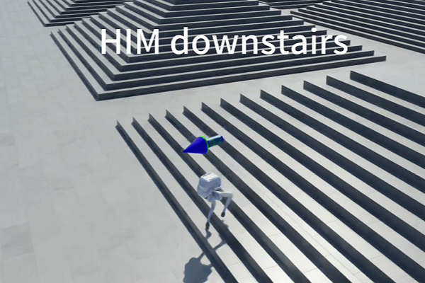
    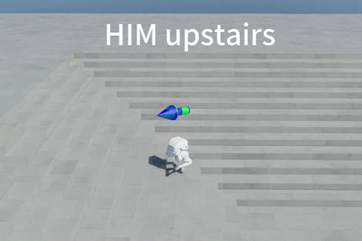
    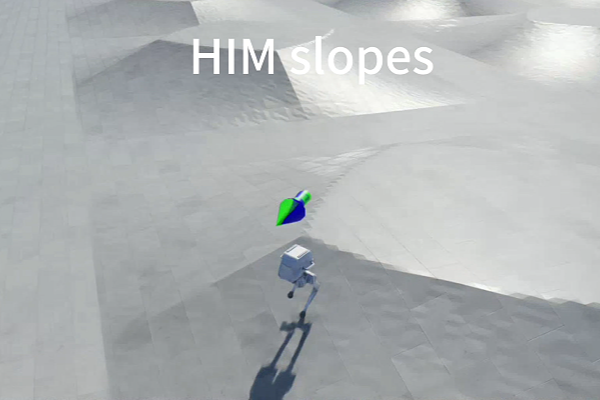
  

  

    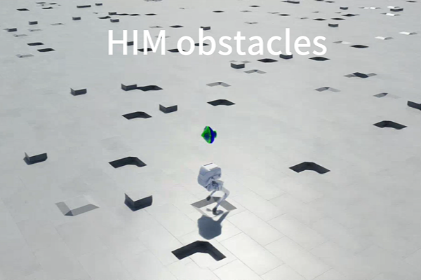
    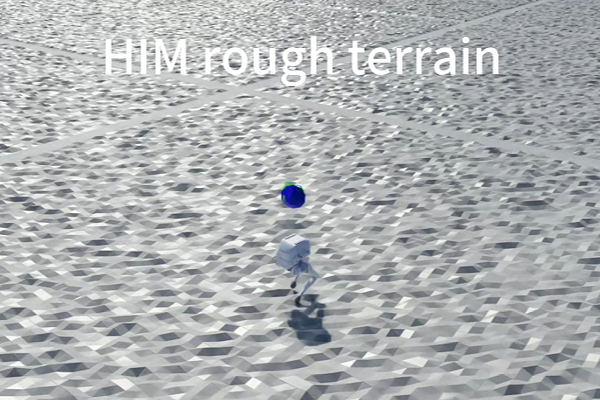
  

**Figure 9: HIM Velocity Tracking Curve on Stairs Terrain**

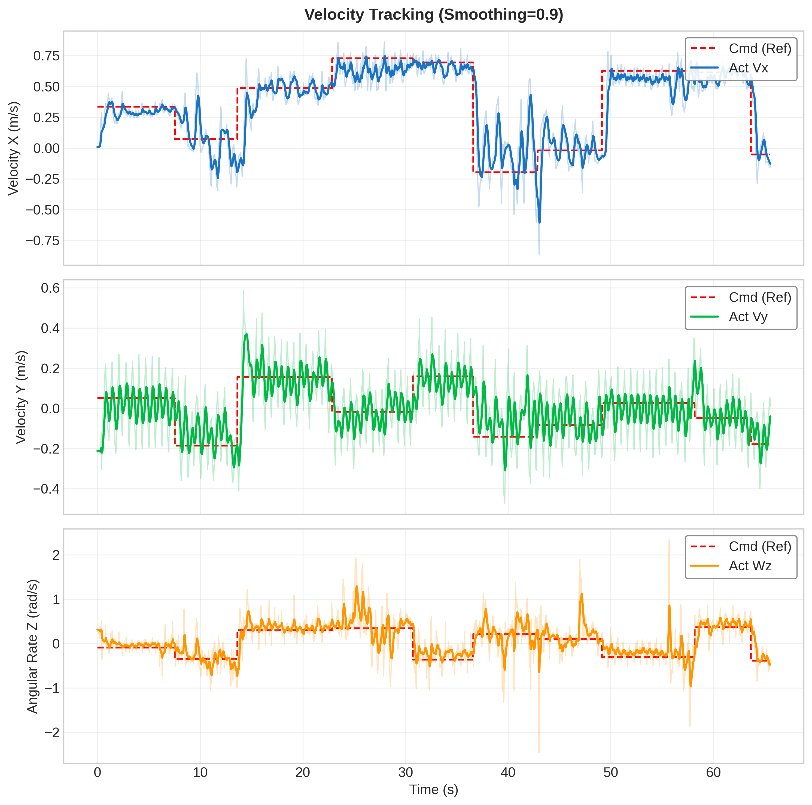

**Figure 10: PIM Complex Terrain Velocity Tracking Simulation Screenshot**

  

    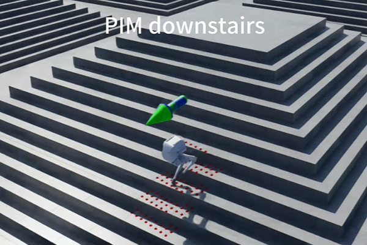
    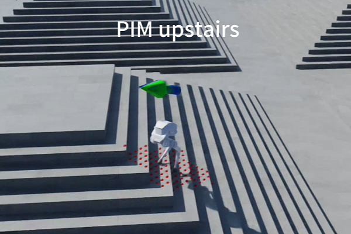
    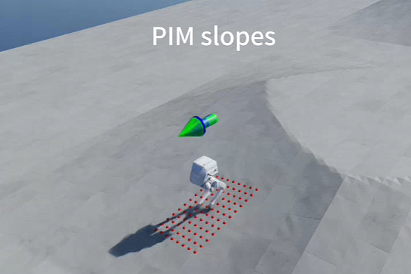
  

  

    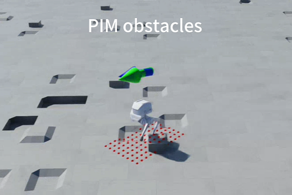
    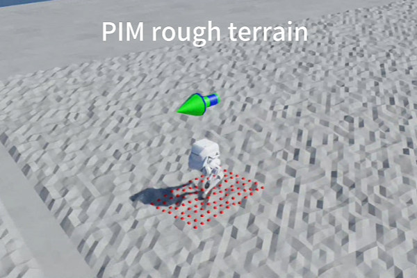
    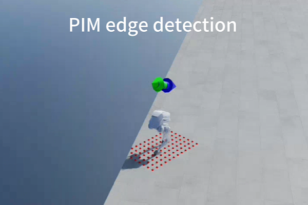
  

**Figure 11: PIM Velocity Tracking Curve on Stairs Terrain**

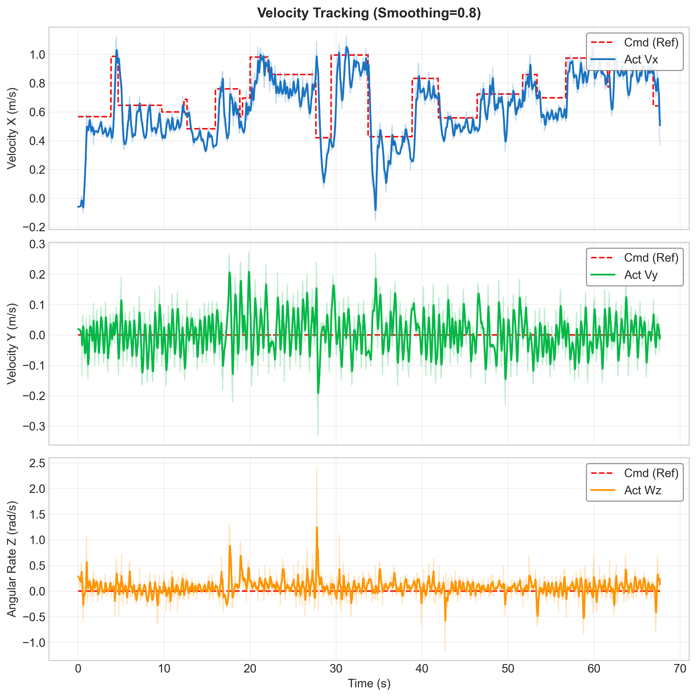

**Data Analysis:**

**Command Velocity Tracking Situation**

-   Both HIM and PIM demonstrate good command velocity tracking effects in complex terrains (taking stairs terrain as an example).

    | Algorithm | Metric                                    | Value                |
    | --------- | ----------------------------------------- | -------------------- |
    | **HIM**   | **Linear Velocity Tracking MSE** ($v_x$)  | 0.032 $(m/s)^2$      |
    |           | **Linear Velocity Tracking MSE** ($v_y$)  | 0.018$(m/s)^2$       |
    |           | **Angular Velocity Tracking MSE** ($w_z$) | 0.11$(rad/s)^2$      |
    | **PIM**   | **Linear Velocity Tracking MSE** ($v_x$)  | **0.029** $(m/s)^2$  |
    |           | **Linear Velocity Tracking MSE** ($v_y$)  | **0.0062**$(m/s)^2$  |
    |           | **Angular Velocity Tracking MSE** ($w_z$) | **0.052**$(rad/s)^2$ |

-   From the data, it can be found that **PIM**'s velocity tracking errors in all directions are smaller than HIM, demonstrating the strong **adaptation capability** of **perceptive** motion control algorithms to **complex terrains**.
-   Even as a blind motion control strategy, **HIM**'s **linear velocity tracking** error on stairs terrain is still far **superior** to the Encoder-MLP algorithm. Taking $v_x$ tracking as an example, the improvement is up to **78.67%**.

**Maximum Traversable Terrain Difficulty**

Using the terrain difficulty convergence value at the final stage of training as the maximum traversable terrain difficulty metric.

-   HIM: Converged to around 3.8.

    | **Sub-terrain Type**   | **Parameter Item** | **Range Config** | **Converged Value**      |
    | ---------------------- | ------------------ | ---------------- | ------------------------ |
    | **Stairs**             | Step Height        | 0.05 ~ 0.20 m    | **11.33 cm**             |
    | **Rough Terrain**      | Noise Height       | 0.01 ~ 0.06 m    | **3.11 cm**              |
    | **Smooth Slope**       | Slope              | 0.0 ~ 0.7        | **0.295 (approx 16.5°)** |
    | **Discrete Obstacles** | Obstacle Height    | 0.05 ~ 0.15 m    | **9.22 cm**              |

-   PIM: Converged to around 5.2.

    | **Sub-terrain Type**   | **Parameter Item** | **Range Config** | **Result Value**         |
    | ---------------------- | ------------------ | ---------------- | ------------------------ |
    | **Stairs**             | Step Height        | 0.05 ~ 0.20 m    | **13.67 cm**             |
    | **Rough Terrain**      | Noise Height       | 0.01 ~ 0.06 m    | **3.89 cm**              |
    | **Smooth Slope**       | Slope              | 0.0 ~ 0.7        | **0.405 (approx 22.0°)** |
    | **Discrete Obstacles** | Obstacle Height    | 0.05 ~ 0.15 m    | **10.78 cm**             |

**Motion Continuity**

-   Neither HIM nor PIM showed obvious collisions or action coordination loss.

**Edge Detection**

-   Since HIM is a blind strategy, it cannot detect terrain edges and will fall off the edge following command velocity.
-   **PIM** utilizes the advantage of **sensors**, capable of **detecting edges** and resisting command velocity to control itself **not to fall**.

---

## 6. Open Source Project Release

To verify the reproducibility, engineering integrity, and scalability of the algorithms implemented in this paper, and to promote reuse and exchange of related research work, this paper organizes and publishes the various gait control algorithms (Encoder-MLP / HIM / PIM) implemented based on Isaac Lab as a standard open source project. The project covers the complete process from environment configuration, training scripts to visualization demos, complying with the organization specifications of mainstream robot learning open source projects.

### 6.1 Project Link

-   GitHub Repository:
    https://github.com/DongyangLin/SDM5008Project.git

-   Demo Video / GIF:
    Gif see project [README.md](../README.md), full demo video see Blackboard.

### 6.2 Project Usage

[README.md](../README.md) contains project introduction, environment configuration guide, training and testing command examples, Demo videos, main code framework, etc.

---

## References

[^1]:Long, J., Ren, J., Shi, M., Wang, Z., Huang, T., Luo, P., & Pang, J. (2024). **Learning Humanoid Locomotion with Perceptive Internal Model**. *arXiv preprint arXiv:2411.14386*. https://arxiv.org/abs/2411.14386
[^2]:Long, J., Wang, Z., Li, Q., Gao, J., Cao, L., & Pang, J. (2024). **Hybrid Internal Model：Learning Agile Legged Locomotion with Simulated Robot Response**. *The Twelfth International Conference on Learning Representations (ICLR)*. https://arxiv.org/abs/2312.11460